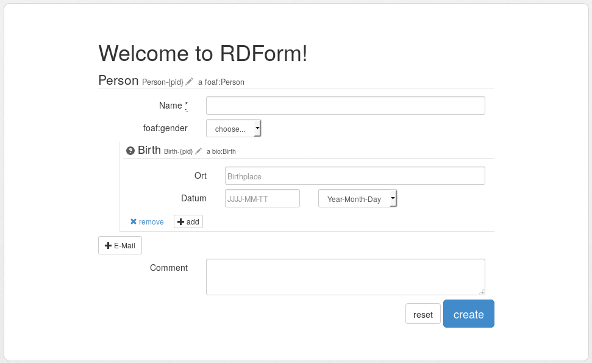

# RDForm

RDForm is a jQuery plugin for creating and editing RDF data in a clean and modern HTML form.

This [feature-shacl branch](/tree/feature-shacl) implements [SHACL](https://www.w3.org/TR/shacl/) as template notation.

Its currently in a very early state, see [#18](https://github.com/simeonackermann/RDForm/issues/18) for the current implementation state.

The inserting of existing data and the output is done as a JavaScript object with the [JSON-LD](https://github.com/digitalbazaar/jsonld.js) notation.

For a **running example** see https://simeonackermann.github.io/RDForm/.

> This software is currently in a very early state. Please be careful when use it in a productive environment.

## Screenshot ##



## Installation ##

### Via npm

`npm i @donsi/rdform`


### Manually

* download the source code
* open [index.html](index.html) in your browser for a sample form.

The load of templates and hooks requires a running http server. You can use docker for example:

	docker run --name rdform -v $(pwd):/usr/share/nginx/html -p 8080:80 nginx

and access at http://localhost:8080

### Integrate

If you want to integrate RDForm into an existing project you have to include [jQuery](http://jquery.com/) (> 1.8) (and for a good style [Bootstrap](getbootstrap.com/)). Have a look at [index.html](index.html) for the right structure.

# Usage

The basic initialization of the plugin with callback function on submit is:

```js
$(document).ready(function(){
	var shape = {
		"@context": {
            "@base": "http://example.org/"
        },
        "@id": "PersonShape",
        "@type": "sh:NodeShape",
        "sh:name": "Person",
        "sh:targetClass" : {"@id": "foaf:Person"},
        "sh:property" : [
            {
                "sh:path" : { "@id": "foaf:name" },
                "sh:datatype" : { "@id": "xsd:string" },
                "sh:name" : "Name"
            }
        ]
	}
	var shapeExtension = {
        "@context": {
            "@base": "http://example.org/"
		},
		"@id": "PersonShape",
		"rdf:value": "person-{foaf:name}"
	};
	$(".rdform").RDForm({
		template: shape,
		templateExtension: shapeExtension,
		submit: function() {
			console.log( JSON.stringify(this, null, '\t') );
		}
	});
});
```

See `index.html` or a broader example.

## URI generation

To create new ressources you have to pass the URI generation shape like in the example above.

# Template Documentation #

### Content ###

- Parameter
- Template Documentation
	- Classes
	- Literal-Properties
	- Class-Resources
	- External resources
	- Hidden-Properties
	- Wildcards
	- Translation
- Insert Data
- Hooking

## Paramter ##

The following parameters can given to the plugin (see Installation above):

Parameter (Type) | Default | Description
--- | --- | ---
`template` (Object) | null | SHACL shape
`data` (Object) | null | Array or Object of existing data to insert
`rootShape` (String) | null | @id of the root shape
`templateExtension` (Object) | null | Extend the SHACL shape with RDForm specifics, like URI generation, textarea, subform arguments, selects etc. Given as JSON-LD object.
`hooks` (String) | null | Path to the hooks file
`prefixes` (Object)	| {  foaf: ..., rdf: ..., rdfs: ..., ...} (see rdform.js) | Object with prefiex and URIs
`base` (String)	| null | Base URI
`lang` (String) | null | Path to the language file
`cache` (Boolean) | false | true or false, loads template from cache
`verbose` (Boolean)  | false | true or false, output all messages and the result
`debug` (Boolean) false | log error, warnings and infos into the console
`submit` (Function)	| null | Submit callback function, will be called after submit the form
`abort` (Function)	| null | Abort callback function, will be called on aborting the form


## Template Documentation ##

See [#18](https://github.com/simeonackermann/RDForm/issues/18) for the current implementation state.


### Translation ###

Strings in legends, labels and placeholder can translated with `l(My Label)`. The translation files are stored in [lang/](lang/) (currently only english and german) and must be given as `lang` argument to the plugin.

Example:

```js
$(".rdform").RDForm({
	template: shape,
	lang: "de"
});
```

## Insert Data ##

Existing data can inserted as [json-ld](http://json-ld.org/) javascript object. The form of the data should fit to the loaded template. RDForm will insert the data into the form fields.

Example:

```js
var data = {
	"@id": "http://json-ld.org/playground/Person-Karl",
	"@type": [
		"http://xmlns.com/foaf/0.1/Person"
	],
	"http://xmlns.com/foaf/0.1/name": [
		{
			"@type": "xsd:string",
			"@value": "Karl"
		}
	]
};

$(".rdform").RDForm({
	template: shape,
	data: data
});
```

## Hooking ##

With hooks own JavaScript methods can affect the application execution on certain points. Have a look at [js/hooks/hooks.js](js/hooks/hooks.js) for more information.


## License ##

RDForm is licensed under the [GNU General Public License Version 2, June 1991](http://www.gnu.org/licenses/gpl-2.0.txt).
